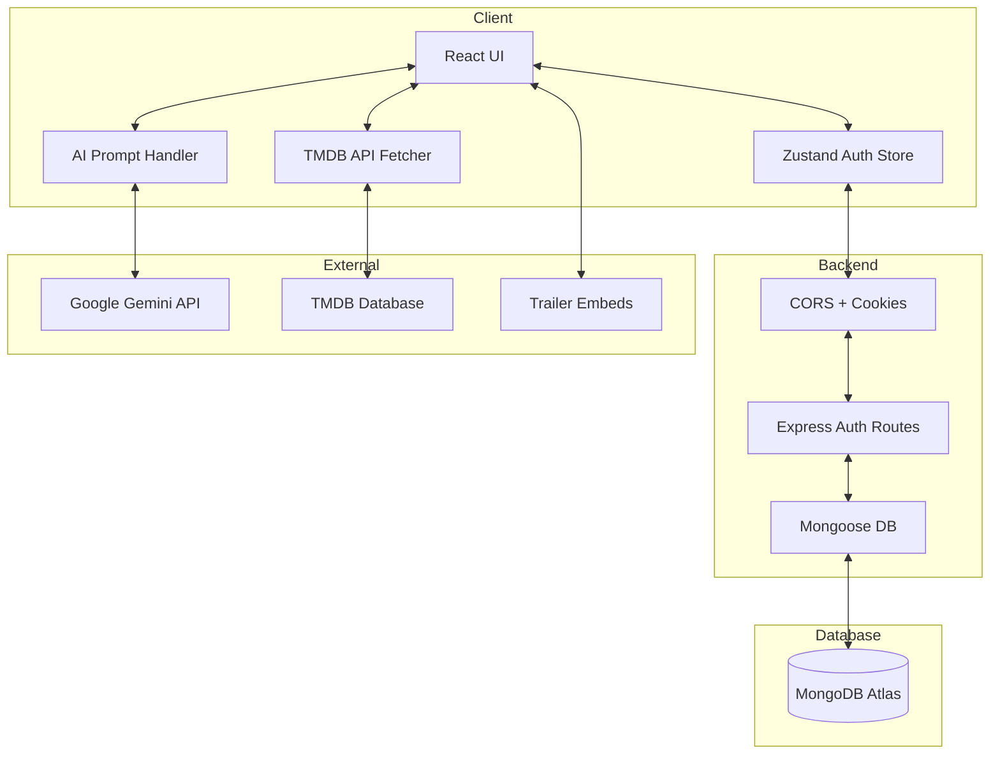
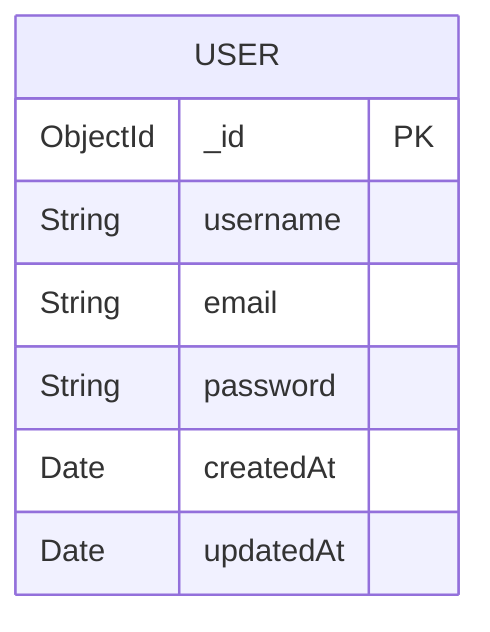
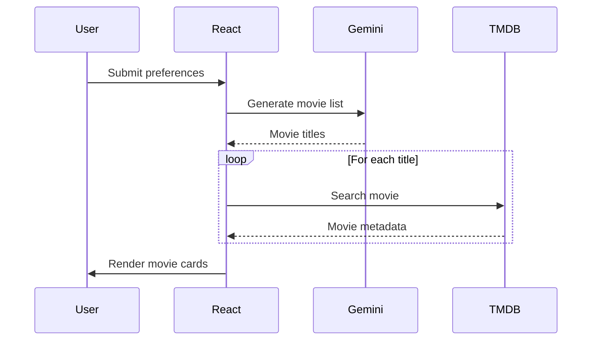
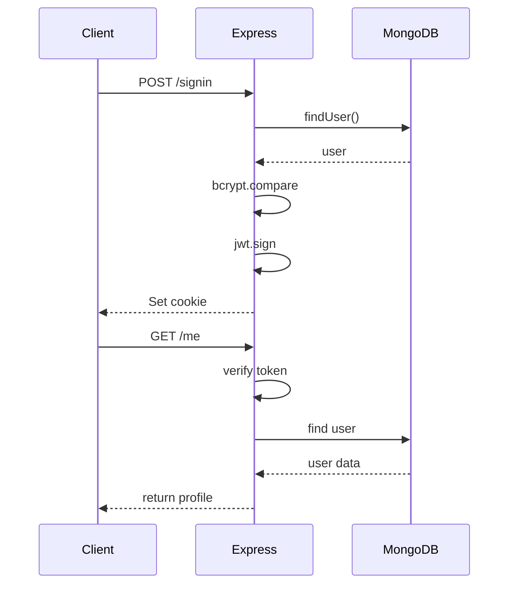

```
# CineMind - AI-Powered Movie Discovery Platform

## Live Deployment

**Live Application:**  
https://ai-powered-netflix-clone.onrender.com/

**Frontend Repository:**  
https://github.com/karthikakrishna123/ai_powered_netflix_clone

CineMind is an advanced, full-stack streaming application engineered to emulate the Netflix experience while introducing next-generation Generative AI search capabilities.

Instead of traditional keyword matching, CineMind uses Natural Language Processing (NLP) to understand mood, genre, time period, narrative pacing and returns AI-generated personalized movie recommendations.

## Table of Contents

1. [Project Overview](#project-overview)
2. [System Architecture](#system-architecture)
3. [UML Diagrams](#uml-diagrams)
4. [Tech Stack](#tech-stack)
5. [Directory Structure](#directory-structure)
6. [API Reference](#api-reference)
7. [Installation & Setup](#installation--setup)
8. [Deployment Architecture](#deployment-architecture)

## Project Overview

### Core Features

**AI Semantic Search**  
Uses Google Gemini 1.5 Flash to generate movie recommendations based on natural language prompts.

Example prompt:  
“Give me slow emotional drama movies from the 1990s.”

The system returns a structured JSON list of movies.

**Secure Authentication**  
Authentication uses JWT tokens, HTTP-only cookies, SameSite=None, and Secure cookies. This prevents XSS token theft and localStorage vulnerabilities.

**Dynamic Movie Data**  
Movie metadata comes from TMDB API including posters, ratings, genres, trailers, and descriptions.

**Responsive UI**  
Frontend built with React, TailwindCSS, and Swiper.js featuring mobile-first design, smooth carousel animations, and Netflix-style browsing.

## System Architecture

CineMind follows a decoupled architecture.

**Frontend responsibilities:** UI rendering, AI search prompt generation, TMDB queries.  
**Backend responsibilities:** authentication, session management, database interaction.

### High-Level Architecture



## UML Diagrams

### Database Schema



### AI Recommendation Flow



### Authentication Flow



## Tech Stack

### Frontend


**Additional:** Axios, Google Generative AI SDK, Lucide Icons, React Hot Toast, React Router

### Backend


**Additional:** Bcrypt, Cookie Parser, CORS, dotenv, Google Gemini API, TMDB API

## Directory Structure

```bash
ai_powered_netflix_clone
├── backend
│   ├── config
│   │   └── db.js
│   ├── models
│   │   └── user.model.js
│   ├── server.js
│   └── package.json
└── frontend
    ├── src
    │   ├── components
    │   │   ├── Navbar.jsx
    │   │   ├── CardList.jsx
    │   │   ├── VideoPlayer.jsx
    │   │   └── RecommendedMovies.jsx
    │   ├── pages
    │   │   ├── Homepage.jsx
    │   │   ├── Moviepage.jsx
    │   │   ├── SignIn.jsx
    │   │   └── SignUp.jsx
    │   ├── lib
    │   │   └── AIModel.js
    │   └── store
    │       └── authStore.js
    ├── vite.config.js
    └── package.json
```

## API Reference

**Base URL:** `/api/auth`

- **Signup** → `POST /signup`
- **Signin** → `POST /signin`
- **Current User** → `GET /me` (cookie based)
- **Logout** → `POST /logout`

## Installation & Setup

### Clone the Repository

```bash
git clone https://github.com/karthikakrishna123/ai_powered_netflix_clone.git
cd ai_powered_netflix_clone
```

### Backend Setup

```bash
cd backend
npm install
```

Create `.env` file:

```env
PORT=5000
MONGO_URI=your_mongo_uri
JWT_SECRET=your_secret
CLIENT_URL=http://localhost:5173
```

Run backend:

```bash
npm run dev
```

### Frontend Setup

```bash
cd frontend
npm install
```

Create `.env` file:

```env
VITE_TMDB_API_KEY=your_tmdb_token
VITE_GOOGLE_GENAI_API_KEY=your_gemini_key
```

Run frontend:

```bash
npm run dev
```

## Deployment Architecture

Recommended hosting: **Render**

Production considerations already handled:
- Trust proxy enabled
- Secure cookies enabled
- SameSite=None configured
- CORS configured for cross-origin cookies

## Author

**Karthika Krishna M (KK)**  
Computer Science Engineer | MERN Developer | AI Enthusiast  

GitHub: https://github.com/karthikakrishna123
```
