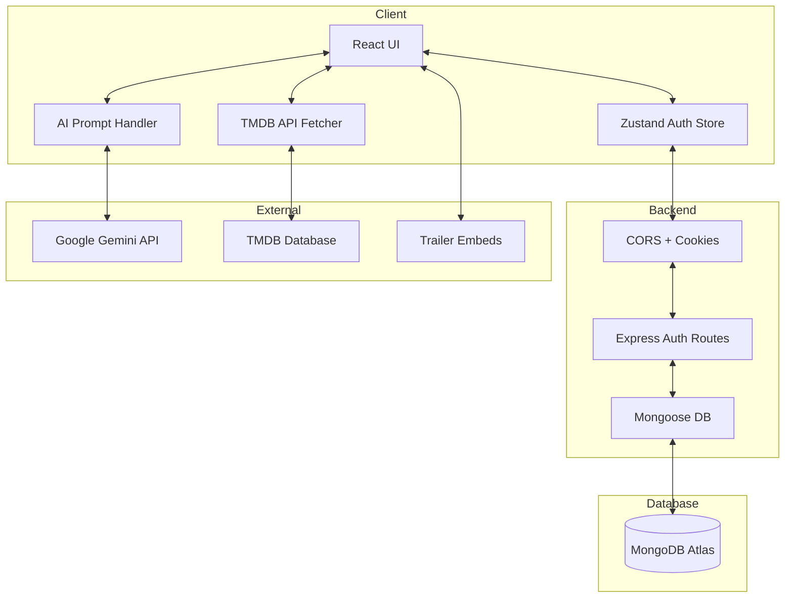
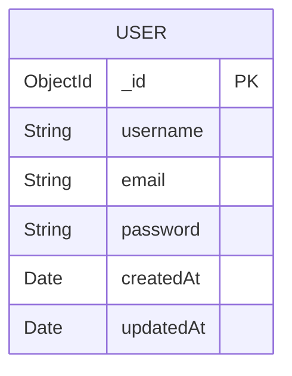
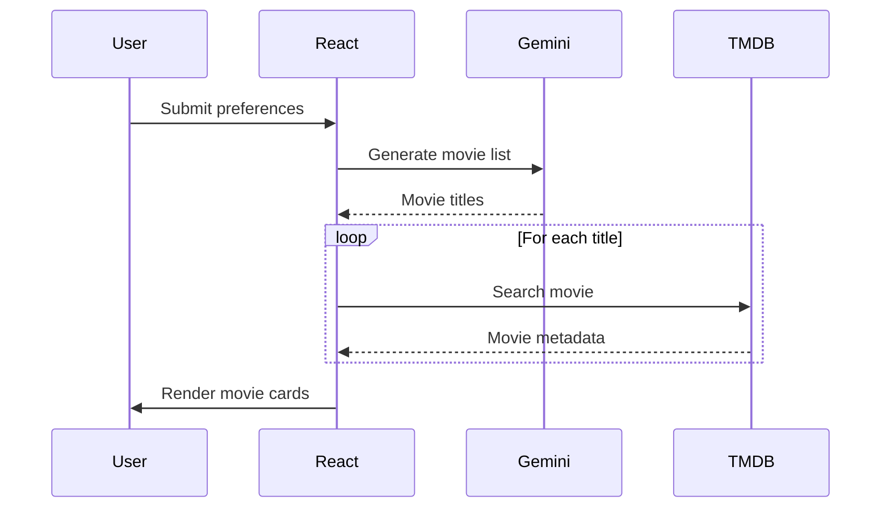
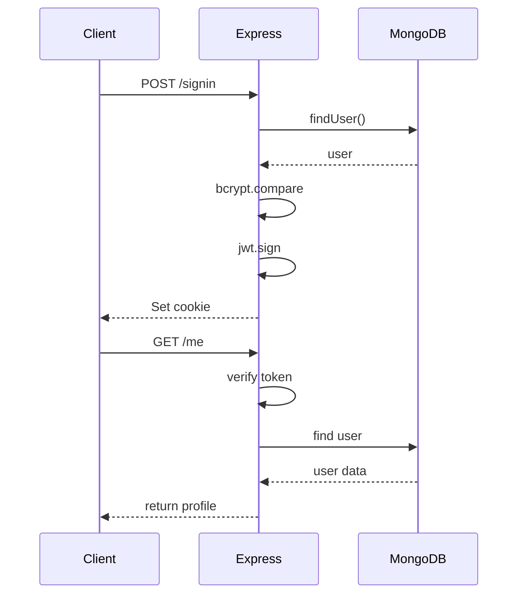

```markdown
# CineMind - AI-Powered Movie Discovery Platform

## Live Deployment

**Live Application:**  
https://ai-powered-netflix-clone.onrender.com/

**Frontend Repository:**  
https://github.com/karthikakrishna123/ai_powered_netflix_clone

CineMind is an advanced, full-stack streaming application engineered to emulate the Netflix experience while introducing next-generation Generative AI search capabilities.

Instead of traditional keyword matching, CineMind uses Natural Language Processing (NLP) to understand mood, genre, time period, narrative pacing and returns AI-generated personalized movie recommendations.

## Table of Contents

1. Project Overview  
2. System Architecture  
3. UML Diagrams  
4. Tech Stack  
5. Directory Structure  
6. API Reference  
7. Installation & Setup  
8. Deployment Architecture  

## Project Overview

### Core Features

**AI Semantic Search**  
Uses Google Gemini 1.5 Flash to generate movie recommendations based on natural language prompts.  

Example prompt:  
“Give me slow emotional drama movies from the 1990s.”  

The system returns a structured JSON list of movies.

**Secure Authentication**  
Authentication uses JWT tokens, HTTP-only cookies, SameSite=None, and Secure cookies. This prevents XSS token theft and localStorage vulnerabilities.

**Dynamic Movie Data**  
Movie metadata comes from TMDB API including posters, ratings, genres, trailers, and descriptions.

**Responsive UI**  
Frontend built with React, TailwindCSS, and Swiper.js featuring mobile-first design, smooth carousel animations, and Netflix-style browsing.

## System Architecture

CineMind follows a decoupled architecture.  

**Frontend responsibilities:** UI rendering, AI search prompt generation, TMDB queries.  
**Backend responsibilities:** authentication, session management, database interaction.

### High-Level Architecture



## UML Diagrams

### Database Schema



### AI Recommendation Flow



### Authentication Flow



## Tech Stack

### Frontend
- React
- React Router
- TailwindCSS
- Swiper.js
- Axios
- Zustand
- Google Generative AI SDK
- Lucide Icons
- React Hot Toast

### Backend
- Node.js
- Express.js
- MongoDB
- Mongoose
- JWT
- Bcrypt
- Cookie Parser
- CORS
- dotenv

## Project Directory Structure

```
ai_powered_netflix_clone
├ backend
│ ├ config
│ │ └ db.js
│ ├ models
│ │ └ user.model.js
│ ├ server.js
│ └ package.json
└ frontend
  ├ src
  │ ├ components
  │ │ ├ Navbar.jsx
  │ │ ├ CardList.jsx
  │ │ ├ VideoPlayer.jsx
  │ │ └ RecommendedMovies.jsx
  │
  │ ├ pages
  │ │ ├ Homepage.jsx
  │ │ ├ Moviepage.jsx
  │ │ ├ SignIn.jsx
  │ │ └ SignUp.jsx
  │
  │ ├ lib
  │ │ └ AIModel.js
  │
  │ └ store
  │   └ authStore.js
  │
  ├ vite.config.js
  └ package.json
```

## API Reference

**Base URL:** `/api/auth`

**Signup**  
`POST /signup`  
Payload:
```
{
  "username": "string",
  "email": "string",
  "password": "string"
}
```

**Signin**  
`POST /signin`  
Payload:
```
{
  "username": "string",
  "password": "string"
}
```

**Current User**  
`GET /me`  
Uses cookie authentication.

**Logout**  
`POST /logout`  
Clears JWT cookie.

## Installation & Setup

### Clone Repository

```bash
git clone https://github.com/karthikakrishna123/ai_powered_netflix_clone.git
cd ai_powered_netflix_clone
```

### Backend Setup

```bash
cd backend
npm install
```

Create `.env` file in backend folder:

```
PORT=5000
MONGO_URI=your_mongo_uri
JWT_SECRET=your_secret
CLIENT_URL=http://localhost:5173
```

Run backend server:

```bash
npm run dev
```

### Frontend Setup

```bash
cd frontend
npm install
```

Create `.env` file in frontend folder:

```
VITE_TMDB_API_KEY=your_tmdb_token
VITE_GOOGLE_GENAI_API_KEY=your_gemini_key
```

Run frontend:

```bash
npm run dev
```

## Deployment Architecture

Recommended hosting: Render  

Production considerations already handled:
- Trust proxy enabled
- Secure cookies enabled
- SameSite=None configured
- CORS configured for cross-origin cookies

## Author

**Karthika Krishna M (KK)**  
Computer Science Engineer | MERN Developer | AI Enthusiast  

GitHub: https://github.com/karthikakrishna123
```

